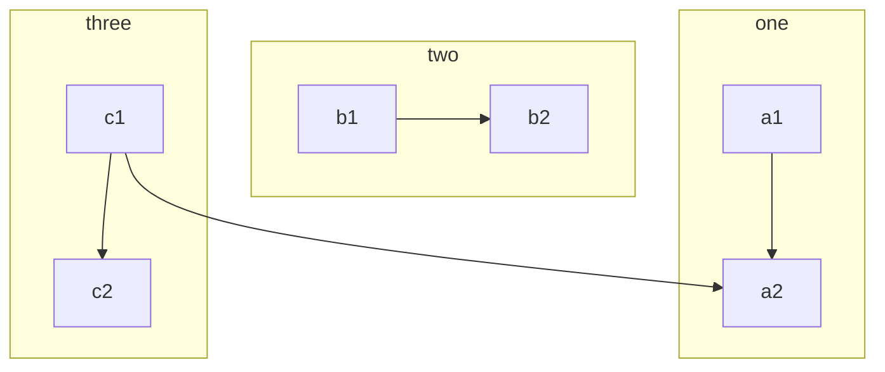
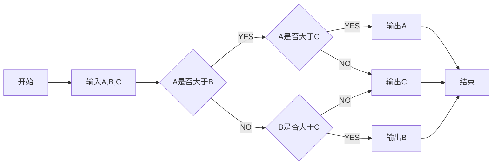

#### 1.markdown画流程图---flow语法

1. 英文状态下连写三个“`”，后面加上Java即以Java语言记录当前代码。我们写入flow


2. 基本语法格式

```
tag=>type: content:>url
```


3. 说明
   - tag 是流程图中的标签，在第二段连接元素时会用到。名称可以任意，一般为流程的英文缩写和数字的组合。
   - type 用来确定标签的类型，`=>`后面表示类型。由于标签的名称可以任意指定，所以要依赖type来确定标签的类型
   - 标签有6种类型：`start` `end` `operation` `subroutine` `condition` `inputoutput`
   - content 是流程图文本框中的描述内容，`: `后面表示内容，中英文均可。特别注意，冒号与文本之间一定要有个`空格`
   - url是一个连接，与框框中的文本相绑定，`:>`后面就是对应的 url 链接，点击文本时可以通过链接跳转到 url 指定页面

4. 连接流程图元素阶段的语法就简单多了，直接用->来连接两个元素，几点说明如下：

   **说明**：

   - 使用 `->` 来连接两个元素
   - 对于`condition`类型，有`yes`和`no`两个分支，如示例中的`cond(yes)`和`cond(no)`
   - 每个元素可以制定分支走向，默认`向下`，也可以用`right`指向右边，如示例中`sub1(right)`。


实例：

```flow
str=>start: 开始
e=>end: 结束
c2=>operation: B
str(right)->c2->e

```


#### 2.markdown画流程图---mermaid方法

1. 英文状态下连写三个“`”，后面加上Java即以Java语言记录当前代码。我们写入mermaid

   

2. 流程图方向

   - TB 从上到下
   - BT 从下到上
   - RL 从右到左
   - LR 从左到右
   - TD 同TB

   ```mermaid
   graph LR
      A --> B 
   ```

   

3. #### 基本图形

   - id + [文字描述]矩形
   - id + (文字描述)圆角矩形
   - id + >文字描述]不对称的矩形
   - id + {文字描述}菱形
   - id + ((文字描述))圆形

   ```mermaid
   graph TD
       id[带文本的矩形]
       id4(带文本的圆角矩形)
       id3>带文本的不对称的矩形]
       id1{带文本的菱形}
       id2((带文本的圆形))
   ```

4. #### 节点之间的连接

   - A --> B     A带箭头指向B
   - A --- B      A不带箭头指向B
   - A -.- B      A用虚线指向B
   - A -.-> B    A用带箭头的虚线指向B
   - A ==> B   A用加粗的箭头指向B
   - A -- 描述 --- B       A不带箭头指向B并在中间加上文字描述
   - A -- 描述 --> B      A带箭头指向B并在中间加上文字描述
   - A -. 描述 .-> B      A用带箭头的虚线指向B并在中间加上文字描述
   - A == 描述 ==> B  A用加粗的箭头指向B并在中间加上文字描述

   ```mermaid
   graph LR
       A[A] --> B[B] 
       A1[A] --- B1[B] 
       A4[A] -.- B4[B] 
       A5[A] -.-> B5[B] 
       A7[A] ==> B7[B] 
       A2[A] -- 描述 --- B2[B] 
       A3[A] -- 描述 --> B3[B] 
       A6[A] -. 描述 .-> B6[B] 
       A8[A] == 描述 ==> B8[B] 
   ```

5. 子流程格式：

   ```ruby
   subgraph title
       graph definition
   end
   ```

例子：



6. #### 自定义样式

   语法：style id 具体样式

   例子：

   ```mermaid
   graph LR
       id1(Start)-->id2(Stop)
       style id1 fill:#f9f,stroke:#333,stroke-width:4px,fill-opacity:0.5
       style id2 fill:#ccf,stroke:#f66,stroke-width:2px,stroke-dasharray: 10,5
   ```

   


##### DEMO

寻找ABC三个数中最大数



